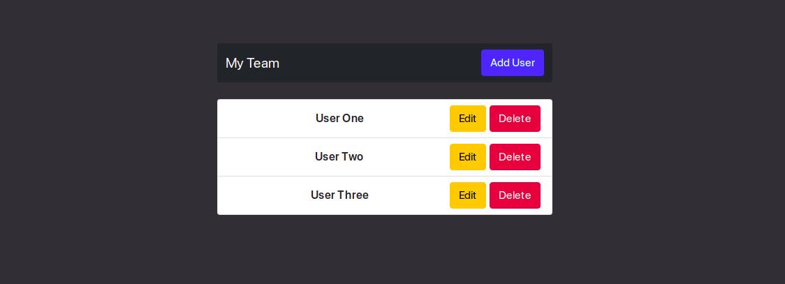
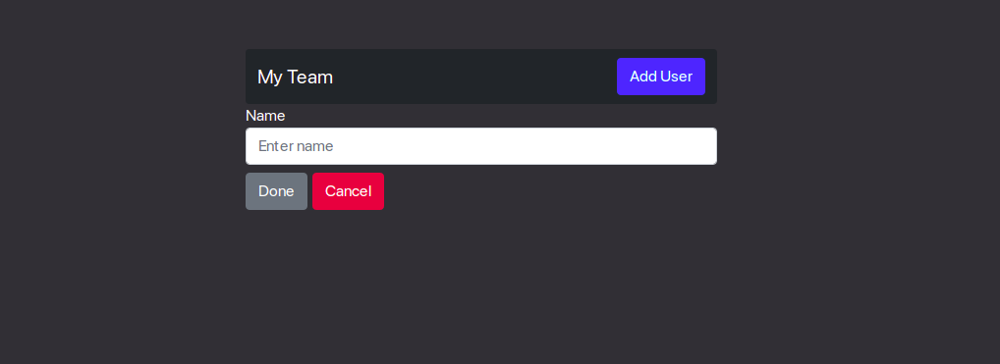

<div align='center'>

# 

# 

</div>

<p align="center">
   <a href="https://www.linkedin.com/in/maganez-filho-b5813b188/">
      
   </a>

  

  <a href='https://react-crud-context-api-maganezf.netlify.app/' >
    
  </a>

  

  <a href="https://github.com/maganezf/react-crud-context-api/commits/main">
    
  </a>
  
  
  <a href="https://github.com/maganezf/GitNam-eRepositoryHere/stargazers">
    
  </a>
</p>

<div align="center">

> This is my 'CRUD application with React Hooks and Context API' project 🤗

<sub>The 'CRUD application with React Hooks and Context API' project. <br/>
Built with ❤︎ by
<a href="https://github.com/maganezf">Maganez Filho</a> and
<a href="https://github.com/maganezf/react-crud-context-api/graphs/contributors">
contributors
</a>
</sub>

</div>

# :pushpin: Table of Contents

- [Live Website](#eyes-live-website)
- [Technologies](#computer-technologies)
- [Purpose and Features](#dart-purpose-and-features)
- [How to Run](#construction_worker-how-to-run)
- [Found a bug? Missing a specific feature?](#bug-issues)
- [Contributing](#tada-contributing)
- [License](#closed_book-license)

<h2 align="left"> 🎨 Layout</h2>
<p align="center">
  <div align="center">
    
    
  </div>
  <br/>
</p>

# :eyes: Live Website

👉 [Click to open Website here](https://react-crud-context-api-maganezf.netlify.app/)

# :computer: Technologies

This project was made using the follow technologies:

- [React.js](https://reactjs.org/)
- [Typescript](https://www.typescriptlang.org/)
- [HTML](https://developer.mozilla.org/en-US/docs/Web/HTML)
- [CSS](https://developer.mozilla.org/en-US/docs/Web/CSS)
- [Node](https://nodejs.org/)
- [Yarn](https://yarnpkg.com/)
- [Netlify (hosting)](https://netlify.com/)

# :dart: Purpose and Features

- Responsive CRUD Application (partial) for study purposes.

# :construction_worker: How to Run

```bash
# Clone Repository and change directory to project
$ git clone https://github.com/maganezf/react-crud-context-api.git && cd react-crud-context-api
```

### 💻 Run Web Project

```bash
# Install Dependencies
$ npm install or yarn install

# Run Application
$ npm start or yarn start
```

Go to http://localhost:3000/ to see the result.

# :bug: Issues

Feel free to **file a new issue** with a respective title and description on the the [React CRUD application](https://github.com/maganezf/react-crud-context-api/issues) repository. If you already found a solution to your problem, **i would love to review your pull request**!

# :tada: Contributing

First of all, thank you for being interested in helping out, your time is always appreciated in every way. 💯

Here's some tips:

- Check the [issues page](https://github.com/maganezf/react-crud-context-api/issues) for already opened issues (or maybe even closed ones) that might already address your question/bug/feature request.
- Feature requests are welcomed! Provide some details on why it would be helpful for you and others, explain how you're using bull-board and if possible even some screenshots if you are willing to mock something!

Check out the [contributing](./CONTRIBUTING) page to see the best places to file issues, start discussions and begin contributing.

# :closed_book: License

Released in 2021 📕 License

Made with ❤︎ by [Maganez Filho](https://github.com/maganezf) 🚀. <br/>
This project is under the [MIT license](./LICENSE).

Give a ⭐️ if this project helped you!
